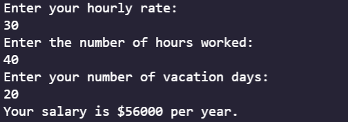

# Salary Calcuator

## Table of Contents

* [Description](#description)
* [Usage](#usage)

## Description

Salary calculator written using Java 16 that allows the user to enter their hourly wage, their hours worked each week, and their number of unpaid vacation days to get an estimate of how much they will earn in a year.

## Usage

Run the program in your IDE and insert your data in the console.

